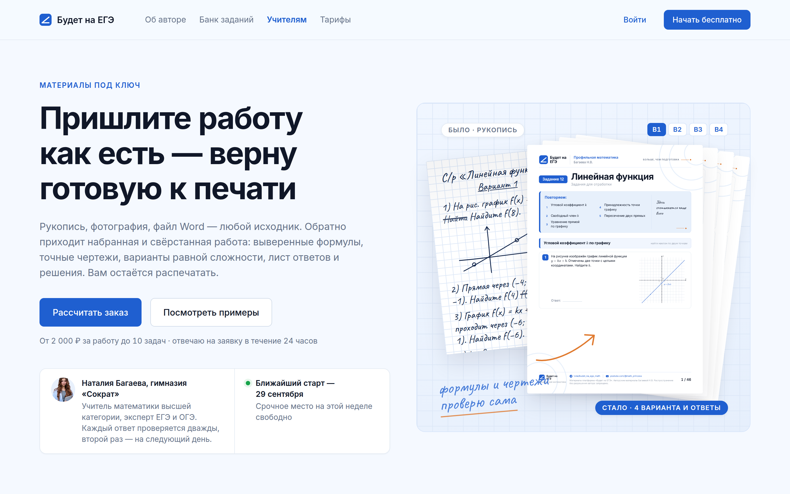
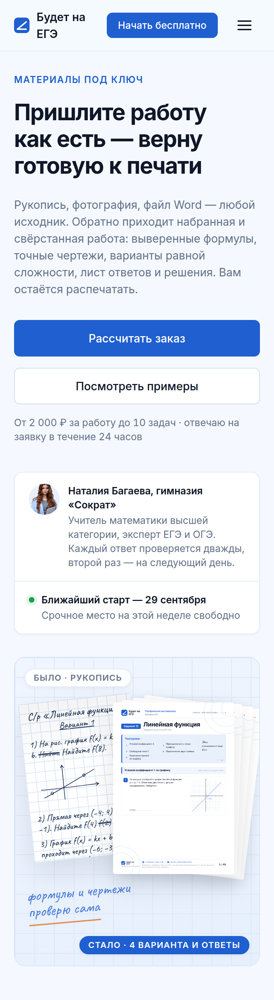
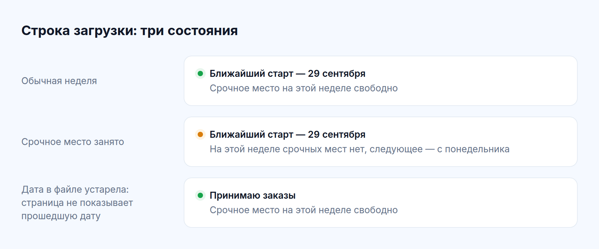
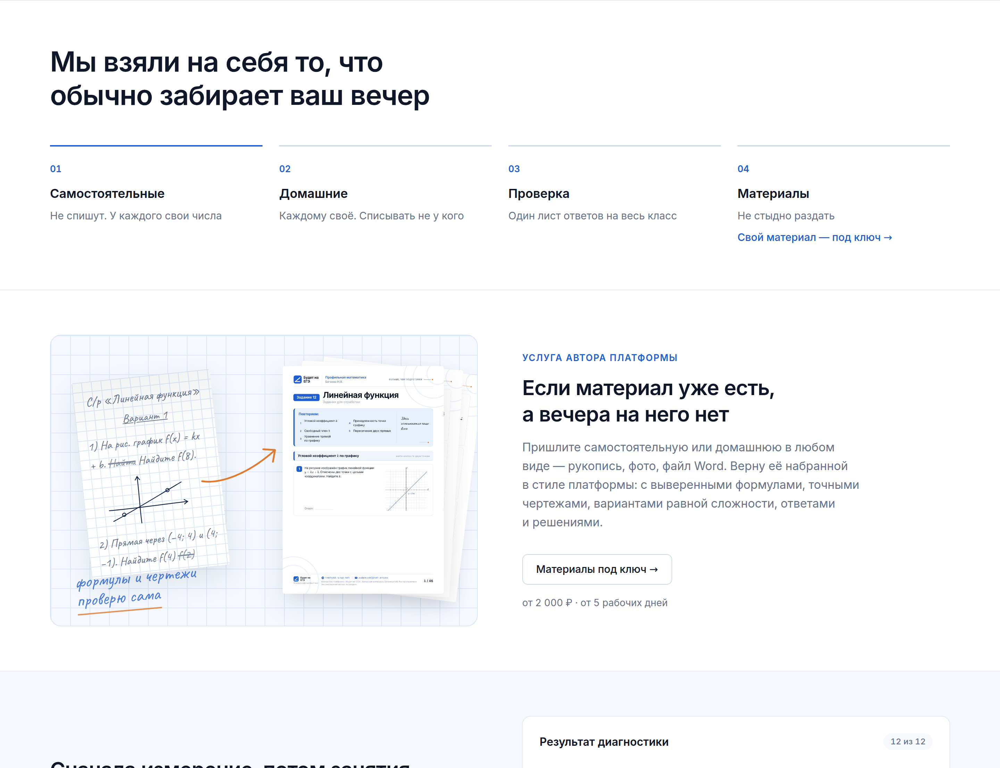
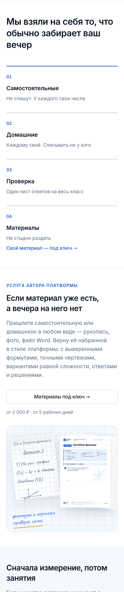

# Этап 1 — мокап первого экрана `/uchitelyam/` и блока-анонса на главной

Версия 1 · 24 сентября 2026 · к документу `docs/SERVICE TEACHERS LANDING.md` (решения этапа 0 — раздел 8).

Мокап собран в токенах платформы, кода сайта нет. Фрагменты разметки вставлены в собранную страницу поверх её стилей. Поэтому шапка, кнопки, шрифты, отступы и цвета на снимках настоящие, а новое — только то, что описано ниже.

Жду вашего «да» или правок. До него к этапу 2 не перехожу.

---

## Что в папке

| Файл | Что это |
|---|---|
| `lending-pervyy-ekran-1440.png` | первый экран лендинга, окно 1440 × 900 — ровно то, что видно без прокрутки |
| `lending-pervyy-ekran-390.png` | он же на телефоне 390 px, целиком |
| `glavnaya-anons-1440.png` | главная: блок «Мы взяли на себя…», под ним анонс, край блока диагностики |
| `glavnaya-anons-390.png` | то же на телефоне |
| `stroka-zagruzki.png` | строка «когда начну» в трёх состояниях, для справки |
| `lending-pervyy-ekran.html`, `glavnaya-anons.html`, `stroka-zagruzki.html` | разметка фрагментов — эталон для этапа 2 |
| `mockup.css` | стили новых элементов, классы с приставкой `svc-` |
| `posle-list-1.png` … `posle-list-4.png` | первые четыре страницы листа №12 из `app/public/materials/`, картинка «стало» |

Снимки сделаны в двойной плотности пикселей. Для повторной съёмки фрагменты вставлялись в собранную главную (`pnpm build`, папка `app/out`), а стили подключались поверх. Рядом со стилями при съёмке лежал латинский файл Caveat из `app/src/fonts/`.

---

## 1. Первый экран лендинга

### Состав сверху вниз

**Шапка** — настоящая `SiteHeader`. Пункт «Учителям» подсвечен как текущий и ведёт на `/uchitelyam/`. Остальное не менялось.

**Левая колонка, текст:**

| Элемент | Текст | Оформление |
|---|---|---|
| Надзаголовок | «Материалы под ключ» | тот же класс, что у надзаголовка главной: прописные, разрядка, основной синий |
| Заголовок | «Пришлите работу / как есть — верну / готовую к печати» | кегль `--fs-h1`, 56 px; три строки с ручным переносом, как «Учителю — / больше времени / на учеников» на главной |
| Подзаголовок | утверждённый текст варианта 1 | `--fs-lg`, вторичный цвет текста |
| Кнопки | «Рассчитать заказ» — основная синяя, ведёт к калькулятору; «Посмотреть примеры» — вторая, ведёт к «было → стало» | размер `btn--lg`, как на главной |
| Строка под кнопками | «От 2 000 ₽ за работу до 10 задач · отвечаю на заявку в течение 24 часов» | как «Бесплатно, без регистрации» под кнопками главной |
| Полоса из двух ячеек | слева — портрет, «Наталия Багаева, гимназия «Сократ»» и утверждённая строка доверия; справа — строка загрузки | белая подложка, рамка и скругление — как полоса показателей «9 980+ / 13 / 1 → ∞» на главной |

**Правая колонка, «было → стало»:**

- Подложка — клетка тетради из сетки героя, на голубом стекле героя.
- Слева повёрнутый рукописный лист с ярлыком «Было · рукопись».
- Справа веер из четырёх свёрстанных листов. Над ним ярлыки вариантов «В1 В2 В3 В4», под ним синий ярлык «Стало · 4 варианта и ответы».
- Между листами — терракотовая стрелка, внизу — рукописная реплика «формулы и чертежи проверю сама» с терракотовой чертой. Это приём листов («Две точки — и прямая твоя») и страницы «Об авторе».

### На телефоне

- Текст сверху, картинка под ним: главное — заголовок и кнопка, картинка работает как доказательство.
- Кнопки во всю ширину, как на главной.
- Полоса «кто делает / когда начну» складывается в две строки.
- Стрелка и ярлыки «В1–В4» на телефоне убраны: на ширине 350 px это мусор. Так же поступает главная со своими линиями построений.

### Строка загрузки

| Состояние | Когда | Точка |
|---|---|---|
| «Ближайший старт — 29 сентября · Срочное место на этой неделе свободно» | обычная неделя | зелёная |
| «Ближайший старт — 29 сентября · На этой неделе срочных мест нет, следующее — с понедельника» | срочное место занято | янтарная |
| «Принимаю заказы · Срочное место на этой неделе свободно» | дата в файле уже прошла | зелёная |

Третье состояние — защита от забытого файла из §4.3 документа: прошедшую дату страница не показывает. Дата «29 сентября» на снимках — пример.

---

## 2. Блок-анонс на главной

### Где и как

- **Место** — сразу после «Мы взяли на себя то, что обычно забирает ваш вечер», перед «Сначала измерение, потом занятия». Утверждено 24.09.
- **Подложка белая**, как у блока над ним. Анонс читается продолжением учительской части главной, а синеватый фон со следующего блока отмечает переход к ученику.
- **В карточке 04 «Материалы — Не стыдно раздать»** добавлена ссылка «Свой материал — под ключ →». Ссылка ведёт на `/uchitelyam/`, анонс стоит сразу под ней.

### Состав

| Элемент | Текст | Оформление |
|---|---|---|
| Картинка слева | тот же «было → стало», меньше: рукопись, стрелка, веер из трёх листов, реплика | без ярлыков «было» и «стало»: в анонсе пара читается и без них |
| Надзаголовок | «Услуга автора платформы» | как надзаголовок героя главной |
| Заголовок | «Если материал уже есть, / а вечера на него нет» | как заголовки соседних блоков-половинок, 30 px |
| Текст | абзац из §2.3 документа без первой фразы: она стала заголовком | как текст соседних блоков |
| Кнопка | «Материалы под ключ →» | вторая, белая с рамкой. Синяя кнопка на главной остаётся одна — «Создать вариант» |
| Строка цены | «от 2 000 ₽ · от 5 рабочих дней» | подпись вторичным цветом |

Чего нет: слов «акция», «скидка», «успейте», таймеров, второй кнопки, значков. Отличает блок от рекламы цена и срок.

### На телефоне

Сначала текст и кнопка во всю ширину, картинка под ними. Стрелки нет.

---

## 3. Что в мокапе условно

| Что | Почему условно | Что будет на сайте |
|---|---|---|
| Рукописный лист | нарисован для мокапа: шрифт Caveat на клетке | фотография вашего настоящего рукописного листа. По v0.1 §5 в витрину идут только ваши материалы |
| Веер «стало» | страницы 1–4 листа №12 — это разные страницы одного сборника, а не варианты | четыре настоящих варианта одной работы, свёрстанные из того же рукописного листа |
| Ярлыки «В1–В4» | подписывают условный веер | остаются, если на сайте будут настоящие четыре варианта |
| Портрет | взят со страницы «Об авторе» | тот же или другой — на ваш выбор |
| Дата «29 сентября» | пример | из файла загрузки |

Латинский Caveat нужен только нарисованному листу: в подключённом на сайте шрифте латиницы и цифр нет. Когда рисунок заменит фотография, шрифт на сайте менять не придётся.

---

## 4. Какие токены использованы

Только семантические токены из `app/src/styles/tokens.css`. Примитивов и хексов в `mockup.css` нет.

| Что | Токены |
|---|---|
| Фон экрана и подложка картинки | `--color-bg`, `--color-glass-mid`, `--color-glass-end`, клетка — `--color-grid-soft`, рамка — `--color-border-info` |
| Текст | `--color-text`, `--color-text-secondary`, чернила рукописи — `--color-text-brand` |
| Акценты | ярлык «Стало» и «В1» — `--color-primary`; стрелка и черта под репликой — `--color-accent` |
| Точка загрузки | `--color-success` с `--color-success-soft`; занято — `--color-warning` с `--color-warning-soft` |
| Кегли | `--fs-h1`, `--fs-lg`, `--fs-caption`, `--fs-label`, `--fs-h4` |
| Рукопись и реплика | `--font-hand` и класс `.hand-note` компонента `HandNote` |
| Тени и скругления | `--shadow-xs`, `--shadow-sm`, `--shadow-md`, `--shadow-lg`; `--radius-sm`, `--radius-lg`, `--radius-xl`, `--radius-pill` |

Новые классы на этапе 2 переедут в стили страницы лендинга и главной. Там же можно будет решить, какие из них стоит сделать компонентами.

---

## 5. Замечено по ходу

На ширине 390 px логотип шапки «Будет на ЕГЭ» переносится на две строки. Так шапка ведёт себя на всём сайте, в мокапе она не менялась. Если это мешает, это отдельная правка шапки, не часть услуги.

---

## 6. Что подтвердить

1. **Композиция первого экрана:** текст слева, «было → стало» справа; на телефоне картинка под текстом.
2. **Строка под кнопками:** «От 2 000 ₽ за работу до 10 задач · отвечаю на заявку в течение 24 часов».
3. **Имя над строкой доверия:** «Наталия Багаева, гимназия «Сократ»». Сама строка утверждена 24.09, имя добавлено, чтобы было видно, кто ручается.
4. **Реплика** «формулы и чертежи проверю сама» — на первом экране и в анонсе.
5. **Анонс:** белая подложка, надзаголовок «Услуга автора платформы», заголовок «Если материал уже есть, а вечера на него нет», текст, кнопка второго уровня.
6. **Ссылка в карточке 04** «Свой материал — под ключ →».
7. **Витрина:** до запуска нужны фотография вашего рукописного листа и четыре настоящих варианта той же работы. Без них первый экран на этап 2 уйдёт с условной картинкой.

После «да» — этап 2: страница `/uchitelyam/` целиком по §6 документа, обработчик заявок по разделу 9, юридические страницы, счётчик Метрики, файл загрузки.
