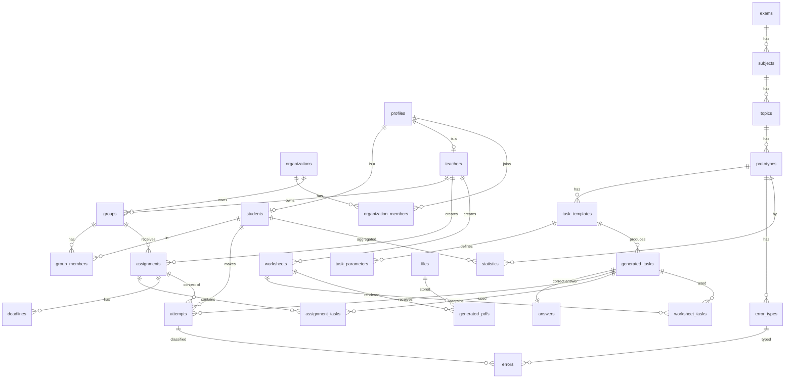

# DATABASE_SCHEMA.md

PostgreSQL 16 (Supabase). Схема `public`; вспомогательные — `analytics`, `audit`.
Все таблицы: `id uuid primary key default uuid_generate_v7()`, `created_at timestamptz default now()`, `updated_at timestamptz` (триггер), RLS **включён**.

---

## 1. Ключевые понятия: Prototype → Template → Generated Task → Attempt

| Уровень | Что это | Кто создаёт | Пример |
|---|---|---|---|
| **Prototype** | Тип задачи по классификации экзамена. Педагогическая единица: «что проверяется». Не содержит чисел. | Методист/админ | «№3. Найти объём цилиндра по радиусу и высоте» |
| **Task Template** | Параметрический генератор для прототипа: диапазоны параметров, ограничения, текст с плейсхолдерами, формула ответа, схема чертежа. Один прототип может иметь несколько шаблонов (разные формулировки, сложность, тип чертежа). | Методист + разработчик | `r ∈ [1..12], h ∈ [1..20]`, «Найдите объём цилиндра, радиус {{r}}, высота {{h}}. Ответ дайте в единицах, делённых на π» |
| **Generated Task** | Конкретный экземпляр: зафиксированные параметры, готовый текст, готовый чертёж, **правильный ответ**, seed. Неизменяем. Один и тот же экземпляр может попасть в тренировку ученика, в назначение и в PDF-вариант. | Система (Task Engine) | `r=3, h=5`, ответ `45` |
| **Attempt** | Действие ученика над Generated Task: введённый ответ, верно/неверно, время, номер попытки, контекст (тренировка / назначение), классифицированная ошибка. | Ученик | ответ `90`, неверно, ошибка «использовал диаметр» |

Аналогия: Prototype — «сорт», Template — «рецепт», Generated Task — «конкретное блюдо», Attempt — «ученик попробовал и сказал, что получилось».

Почему разделяем Prototype и Template: статистика и учебные цели считаются **по прототипу** («ученик слаб в объёме цилиндра»), а генерация и версионирование — **по шаблону**. Можно добавить новый шаблон, не ломая аналитику.

---

## 2. ER-диаграмма



---

## 3. Таблицы

Ниже — DDL в упрощённой форме (тип, ограничения, назначение). Точный SQL — в `supabase/migrations/`.

### 3.1 Пользователи и организации

#### `organizations` (B2B, заложено с M0)
| колонка | тип | назначение |
|---|---|---|
| id | uuid PK | |
| name | text | школа / центр / репетитор-ИП |
| slug | text unique | для URL и SSO |
| plan | text | `free`, `school`, `enterprise` |
| settings | jsonb | лимиты, брендинг |
| deleted_at | timestamptz | |

#### `profiles` (1:1 с `auth.users`)
| колонка | тип | назначение |
|---|---|---|
| id | uuid PK FK auth.users(id) on delete cascade | |
| role | `app_role` enum (`student`,`teacher`,`org_admin`,`admin`,`content_editor`,`parent`) | базовая роль |
| status | `profile_status` (`active`,`pending`,`blocked`) | учителя — `pending` до подтверждения |
| display_name | text | |
| avatar_file_id | uuid FK files | |
| organization_id | uuid FK organizations null | основная организация (для B2B) |
| locale | text default 'ru' | |
| consents | jsonb | согласия 152-ФЗ с датами |
| last_seen_at | timestamptz | |
| deleted_at | timestamptz | |

Триггер `on auth.users insert → profiles insert` (role из `raw_user_meta_data`, по умолчанию `student`).

#### `students` (1:1 с profiles, роль-специфичные данные)
| колонка | тип |
|---|---|
| id | uuid PK FK profiles(id) |
| exam_id | uuid FK exams (целевой экзамен) |
| exam_date | date |
| target_score | smallint |
| grade | smallint (класс) |
| guardian_email | text |
| settings | jsonb (показывать разбор сразу, лимит подсказок) |

#### `teachers`
| колонка | тип |
|---|---|
| id | uuid PK FK profiles(id) |
| organization_id | uuid FK organizations null |
| verified_at | timestamptz |
| verified_by | uuid FK profiles |
| bio | text |
| settings | jsonb |

#### `organization_members`
| колонка | тип |
|---|---|
| organization_id | uuid FK |
| profile_id | uuid FK |
| role | `org_role` (`member`,`teacher`,`org_admin`) |
| PK | (organization_id, profile_id) |

#### `groups`
| колонка | тип |
|---|---|
| id | uuid PK |
| teacher_id | uuid FK teachers not null |
| organization_id | uuid FK organizations null |
| name | text |
| invite_code | text unique (8 симв., ротация) |
| invite_enabled | bool default true |
| exam_id | uuid FK exams |
| archived_at | timestamptz |

Индекс: `(teacher_id) where archived_at is null`.

#### `group_members`
| колонка | тип |
|---|---|
| group_id | uuid FK groups on delete cascade |
| student_id | uuid FK students on delete cascade |
| joined_at | timestamptz |
| left_at | timestamptz null |
| PK | (group_id, student_id) |

---

### 3.2 Каталог контента (предметно-нейтральный)

#### `exams`
`id, code ('ege_math_prof','oge_math'), name, year, settings jsonb (шкала баллов)`

#### `subjects`
`id, exam_id FK, code ('math'), name`

#### `topics`
`id, subject_id FK, number smallint (3), code ('stereometry'), name, order_index, description`

#### `prototypes`
| колонка | тип | назначение |
|---|---|---|
| id | uuid PK | |
| topic_id | uuid FK topics | |
| code | text unique | `ege.math.3.cylinder_volume` |
| name | text | «Объём цилиндра» |
| description | text | что проверяет |
| skills | text[] | `['volume','cylinder','pi']` |
| difficulty | smallint 1–5 | базовая |
| weight | numeric | вес в прогнозе балла |
| status | `content_status` (`draft`,`published`,`archived`) | |
| order_index | int | |

#### `task_templates`
| колонка | тип | назначение |
|---|---|---|
| id | uuid PK | |
| prototype_id | uuid FK prototypes | |
| code | text | `stereo.cylinder.volume.v1` — ключ в `templateRegistry` кода |
| version | int | инкремент при изменении семантики |
| name | text | |
| statement_md | text | Markdown+LaTeX с `{{param}}` |
| solution_md | text null | разбор с плейсхолдерами |
| answer_kind | `answer_kind` (`number`,`integer`,`set`,`string`) | |
| tolerance | numeric default 0 | |
| figure_spec | jsonb null | FigureSpec для Geometry Engine |
| constraints | jsonb | массив выражений |
| distractors | jsonb | `[{error_type_code, formula}]` для классификации ошибок |
| difficulty | smallint | |
| tags | text[] | |
| status | content_status | |
| created_by | uuid FK profiles | |
| UNIQUE | (code, version) | |

#### `task_parameters`
| колонка | тип | назначение |
|---|---|---|
| id | uuid PK | |
| template_id | uuid FK task_templates on delete cascade | |
| name | text | `r` |
| kind | `param_kind` (`int`,`decimal`,`choice`,`derived`) | |
| min, max | numeric null | |
| step | numeric null | |
| choices | jsonb null | для `choice` |
| expression | text null | для `derived` |
| unit | text null | «см» |
| order_index | int | |
| UNIQUE | (template_id, name) | |

> Дублирует часть `task_templates.definition`, но выделено в таблицу ради: удобного редактирования в админке, валидации, аналитики «какие диапазоны дают сложные ответы».

#### `error_types`
`id, prototype_id FK, code ('used_diameter'), name, explanation_md, order_index`

---

### 3.3 Сгенерированные задания и ответы

#### `generated_tasks`  — неизменяемая сущность
| колонка | тип | назначение |
|---|---|---|
| id | uuid PK | |
| template_id | uuid FK task_templates | |
| template_version | int | |
| prototype_id | uuid FK prototypes (денормализация для статистики) | |
| seed | bigint | воспроизводимость |
| params | jsonb | `{r:3,h:5}` |
| derived | jsonb | вычисленные величины |
| statement_md | text | финальный текст |
| figure_svg_file_id | uuid FK files null | кэш чертежа |
| figure_spec | jsonb null | инстанцированная сцена |
| difficulty | smallint | |
| origin | `task_origin` (`practice`,`assignment`,`worksheet`,`preview`) | |
| UNIQUE | (template_id, template_version, seed) | одно задание на seed |

**`correct_answer` здесь НЕТ** — он в `answers`.

#### `answers` — секретная таблица (1:1)
| колонка | тип |
|---|---|
| generated_task_id | uuid PK FK generated_tasks on delete cascade |
| value | jsonb (`{kind:'number', value:45}` или `{kind:'set', values:[1,3]}`) |
| solution_md | text null (инстанцированный разбор) |
| distractors | jsonb (инстанцированные неверные ответы → error_type_id) |

RLS: `select` разрешён **только** `admin`/`content_editor`; ученик и учитель — никогда напрямую. Приложение читает через service role в `checkAnswer`. Учитель видит ответы только через PDF «Ответы» и через view `teacher_task_answers`, которая проверяет, что задание входит в его worksheet/assignment.

#### `attempts`
| колонка | тип | назначение |
|---|---|---|
| id | uuid PK | |
| student_id | uuid FK students | |
| generated_task_id | uuid FK generated_tasks | |
| prototype_id | uuid FK (денорм.) | |
| assignment_id | uuid FK assignments null | контекст |
| attempt_no | smallint | 1,2,3… для этого student+task |
| given_answer | jsonb | как ввёл |
| normalized_answer | jsonb | после нормализации |
| is_correct | bool | |
| time_spent_ms | int | с клиента, sanity-cap 1 ч |
| hint_used | bool | |
| solution_viewed | bool | |
| client_meta | jsonb | device, ua-hash |
| submitted_at | timestamptz | серверное время |
| UNIQUE | (student_id, generated_task_id, attempt_no) | |

Индексы: `(student_id, submitted_at desc)`, `(assignment_id, student_id)`, `(prototype_id, submitted_at)`.

#### `errors` — классифицированные ошибки
| колонка | тип |
|---|---|
| id | uuid PK |
| attempt_id | uuid FK attempts on delete cascade |
| student_id | uuid FK (денорм.) |
| prototype_id | uuid FK (денорм.) |
| error_type_id | uuid FK error_types null (null = неклассифицированная) |
| detail | jsonb (`{matched_distractor:'used_diameter', ratio: 2}`) |

---

### 3.4 Назначения и дедлайны

#### `assignments`
| колонка | тип | назначение |
|---|---|---|
| id | uuid PK | |
| teacher_id | uuid FK teachers | |
| group_id | uuid FK groups null | null = индивидуальное |
| student_id | uuid FK students null | индивидуальное |
| title | text | |
| mode | `assignment_mode` (`practice`,`control`) | control: без разбора до дедлайна, таймер |
| config | jsonb | `{prototypes:[…], count:10, time_limit_min:40, show_solution:'after_deadline', personalized:true}` |
| status | (`draft`,`published`,`closed`) | |
| published_at | timestamptz | |
| CHECK | (group_id is not null) <> (student_id is not null) | |

#### `assignment_tasks`
| колонка | тип |
|---|---|
| assignment_id | uuid FK on delete cascade |
| student_id | uuid FK students null (null = общее для группы) |
| generated_task_id | uuid FK |
| position | smallint |
| PK | (assignment_id, coalesce(student_id, '00000000-…'), position) — реализуется через generated column |

#### `deadlines`
| колонка | тип | назначение |
|---|---|---|
| id | uuid PK | |
| assignment_id | uuid FK on delete cascade | |
| student_id | uuid FK null | персональный перенос |
| due_at | timestamptz | |
| grace_minutes | int default 0 | |
| late_policy | (`reject`,`accept_flagged`,`penalty`) | |
| UNIQUE | (assignment_id, student_id) | |

Логика: действует персональный дедлайн, иначе — общий (student_id null).

---

### 3.5 Варианты и PDF

#### `worksheets`
| колонка | тип | назначение |
|---|---|---|
| id | uuid PK | |
| teacher_id | uuid FK | |
| organization_id | uuid FK null | |
| title | text | |
| exam_id | uuid FK | |
| config | jsonb | `{variants:4, blocks:[{prototype_id, count}], shuffle:true, layout:'two_column'}` |
| variants_count | smallint | |
| status | (`draft`,`generating`,`ready`,`failed`) | |
| seed | bigint | корневой seed |

#### `worksheet_tasks`
| колонка | тип |
|---|---|
| worksheet_id | uuid FK on delete cascade |
| variant_no | smallint |
| position | smallint |
| generated_task_id | uuid FK |
| PK | (worksheet_id, variant_no, position) |

#### `files` (общий реестр Storage)
`id, bucket, path, mime, size_bytes, sha256, owner_id FK profiles null, organization_id null, expires_at null, meta jsonb`

#### `generated_pdfs`
| колонка | тип | назначение |
|---|---|---|
| id | uuid PK | |
| worksheet_id | uuid FK | |
| kind | `pdf_kind` (`tasks`,`answers`,`solutions`,`answer_sheet`) | |
| variant_no | smallint null | null = все варианты в одном файле |
| file_id | uuid FK files null | |
| status | (`pending`,`rendering`,`ready`,`failed`) | |
| renderer | text | `react-pdf@1`, для миграций |
| error | text null | |
| pages | smallint null | |
| rendered_at | timestamptz | |

---

### 3.6 Статистика

#### `statistics` — агрегат student × prototype (обновляется триггером после каждой attempt + ночной пересчёт)
| колонка | тип |
|---|---|
| student_id | uuid FK |
| prototype_id | uuid FK |
| attempts_total | int |
| attempts_correct | int |
| first_try_correct | int |
| avg_time_ms | int |
| last_attempt_at | timestamptz |
| streak_correct | int |
| mastery | numeric 0–1 (EWMA по последним попыткам) |
| PK | (student_id, prototype_id) |

#### Материализованные представления (схема `analytics`)
- `mv_group_prototype_stats(group_id, prototype_id, students, accuracy, avg_time_ms, refreshed_at)`
- `mv_student_daily(student_id, day, attempts, correct, time_ms)`
- `mv_error_heatmap(group_id, prototype_id, error_type_id, count)`
- `mv_template_health(template_id, generated, avg_accuracy, unclassified_error_rate)` — для методистов: «слишком лёгкий / слишком странный шаблон».

Обновление: `pg_cron` каждые 10 мин `refresh materialized view concurrently`.

---

### 3.7 Служебные

#### `audit.audit_log`
`id, actor_id, action ('role.change','template.publish','group.delete', …), entity_type, entity_id, before jsonb, after jsonb, ip_hash, created_at`

#### `analytics.events` (лёгкие продуктовые события, если PostHog недостаточно)
`id, profile_id null, name, props jsonb, created_at` — партиционирование по месяцам.

#### `api_keys` (B2B)
`id, organization_id, name, key_hash, scopes text[], last_used_at, revoked_at`

#### `feature_flags`
`key, enabled, rules jsonb`

---

## 4. Представления для безопасного чтения

```sql
-- То, что видит ученик/учитель о задании
create view generated_tasks_public as
select id, template_id, template_version, prototype_id, statement_md,
       figure_svg_file_id, figure_spec, difficulty, origin, created_at
from generated_tasks;                -- без seed, без params? params — тоже скрываем (по ним можно вычислить ответ)

-- Ответы для учителя: только по его worksheet/assignment
create view teacher_task_answers with (security_invoker = true) as
select a.generated_task_id, a.value, a.solution_md
from answers a
where exists (select 1 from worksheet_tasks wt join worksheets w on w.id = wt.worksheet_id
              where wt.generated_task_id = a.generated_task_id and w.teacher_id = auth.uid())
   or exists (select 1 from assignment_tasks at join assignments s on s.id = at.assignment_id
              where at.generated_task_id = a.generated_task_id and s.teacher_id = auth.uid());
```

Ученик получает `solution_md` только через Server Action `revealSolution()`, который проверяет политику задания (после ответа / после дедлайна) и пишет `attempts.solution_viewed = true`.

---

## 5. Ключевые инварианты (constraints/triggers)

1. `attempts.attempt_no` выставляется триггером (`max+1` под advisory lock) — клиент не присылает.
2. `attempts.is_correct` вычисляется **только** сервером; RLS запрещает `insert` в `attempts` ученикам напрямую — вставка через `security definer` функцию `submit_attempt(...)`, вызываемую Server Action с service role. Это закрывает подделку результата.
3. `generated_tasks` — `update` запрещён всем, кроме `figure_svg_file_id` (кэш).
4. `group_members`: ученик не может состоять в группе учителя из другой организации, если у обеих организации заданы (trigger).
5. `deadlines.due_at > assignments.published_at`.
6. Soft-delete профиля каскадно анонимизирует `display_name`, email в `auth.users` (функция `anonymize_profile`) — для 152-ФЗ «право на удаление» без разрушения статистики группы.

---

## 6. Индексы (минимальный набор)

```
attempts (student_id, submitted_at desc)
attempts (assignment_id, student_id)
attempts (prototype_id, submitted_at)
generated_tasks (template_id, template_version, seed) unique
generated_tasks (prototype_id, origin)
group_members (student_id)
assignments (group_id, status), assignments (student_id, status)
deadlines (assignment_id, student_id) unique
worksheet_tasks (generated_task_id)
files (bucket, path) unique, files (expires_at) where expires_at is not null
task_templates (prototype_id, status), task_templates (code, version) unique
statistics (student_id), statistics (prototype_id, mastery)
```

Полнотекст: `prototypes` и `task_templates` — `tsvector` (russian) по `name || description || tags`.

---

## 7. Расширение на другие экзамены/предметы

Ничего в схеме не привязано к математике. Чтобы добавить ОГЭ:
1. `insert into exams`, `subjects`, `topics`.
2. Создать прототипы и шаблоны.
3. При необходимости — новые генераторы в `src/tasks/templates/oge/*` и, если нужна не-геометрия, новые «движки» (например `src/physics/`), подключаемые через тот же `FigureSpec`/`templateRegistry` интерфейс.

Тарифы/лимиты по экзаменам — в `organizations.settings` и `feature_flags`.
